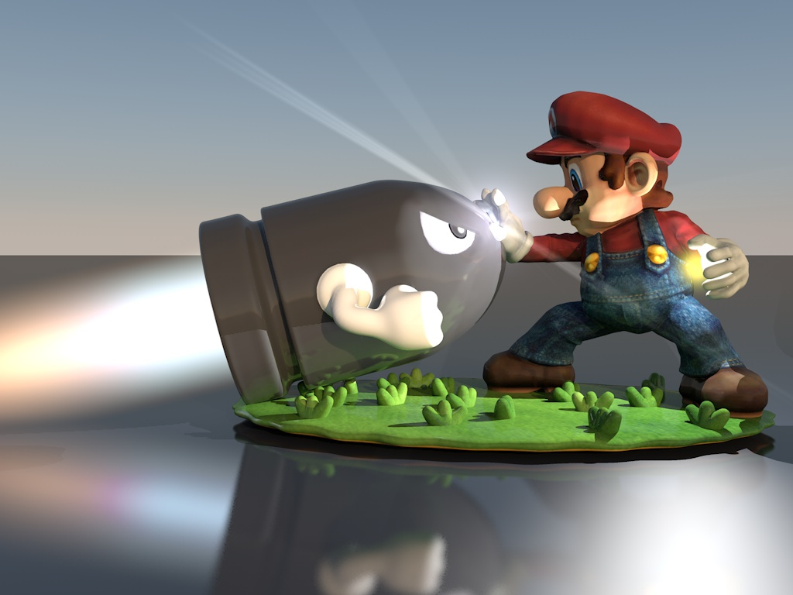

# Antwisted Project #1:
## Super Missile Command Bros.

Missile Command is a 1980 arcade game by Atari, Inc. that was also licensed to Sega for European release. It is considered one of the most notable games from the Golden Age of Video Arcade Games. This game has been reimagined from the perspective of Nintendo's Super Mario Bros. Help Mario save the remaining castles in the Mushroom Kingdom!